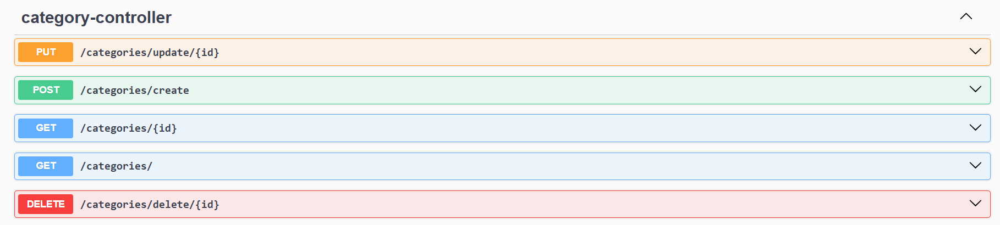

# BookShelf API #

**BookShelf API** - демо RESTful API, предоставляющее возможность записывать добавлять информацию о прочитанных книгах и категоризирвать их. Также есть возможнсть сохранять цитаты.

## Технологии ##
API написан на языке Java с использованием Spring Boot для внедрения зависимотей. Также важно отметить:
* для осуществления авторизации используеются Spring Security;
* для хранения и управления данными используется СУБД PostgreSQL;
* для взаимодействия с СУБД используется Hibernate;
* для документирования API используется Swagger.

## Структура проекта ##
Далее описаны основные составляющие проекта.

### Структура хранения в базе данных ###

Можно выделить 4 сущности в базе данных: цвет (Color), категория (Category), книга (Book) и цитата (Cite). Им соответствуют таблицы в базе данных с аналогичными названиями в нижнем регистре.

**Цвет** содержит информацию о названии и HEX-коде. При добавлении и изменений в код происходит его проверка на соотвествие стандартам. 

**Категория** хранит данные о названии, цвете (может пригодится при использовании API для Android-приложения) и содержащихся в ней книгах. 

**Книги** же связы с категорией посредством связи многие к одному и хранят следущие данные: название, автор, отзыв, оценка и цитаты. 

**Цитаты** аналогичным образом свзяны с книгами связью многие к одному и хранят только информацию о тексте цитаты.

Также каждая указанная сущность имеет id.

### Авторизация ###

Для доступа ко всем эндпоинтам API используется базовая авторизация. Данные пользователя записываются в application.yaml, дополнительной конфигурации для безобасности не создается. 

### Доступные эндпоинты ###
Для каждой структуры были созданы идентичные эндпоинты для создания, получения по id, обновления и удаления. Ниже представлен скриншот из Swagger, иллюстрирующий набор эндпоинтов для сущности категория.

### Обработка ошибок ###
Для обработки ошибок был написан ExceptionResolver чтобы он возвращал сообщения об ошибках. Также были выделены следующие ошибки:
* _CantFindElementById_ - невозможно найти элемент по id;
* _WrongHEXCode_ - HEX-код не соответствует заданному стандарту.
### Дополнительная информация ###
Значительная часть переменныз передается с помощью .env. Для демонстрации списка этих переменных используется .env.example.

## TO DO ##

- [ ] Добавить разделение по пользователями (привязать категории к id пользователей из другой базы данных);
- [ ] Доработать обработку ошибок (добавить возвращение кода ошибки);
- [ ] Разделить доступ к эндпоинтам по пользователям;
- [ ] Расширить модель данных (добавить полей или сущностей)